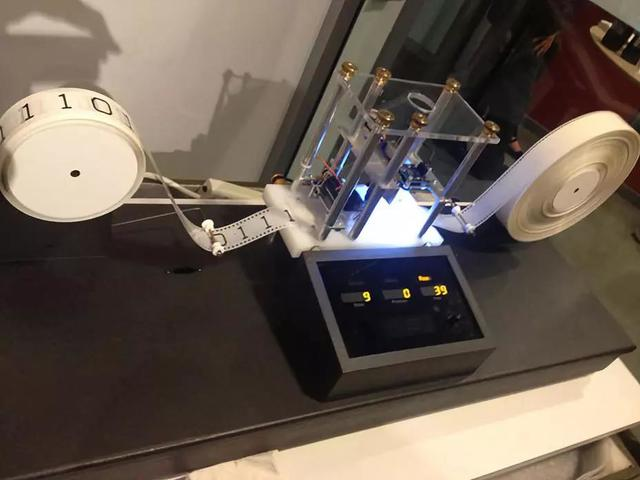

人工智能近年来的崛起，来自于神经网络对经典机器学习的突破，也带了很多商机。众多人工智能初创企业如雨后春笋，视觉，语音，语义，硬件和无人驾驶技术蓬勃发展，
各大巨头也分设人工智能研究员，或者干脆转型成为“人工智能企业”。人工智能的从业者，创业者和投资人，都在试图找到一个问题的答案，机器到底能达到什么样的智能，
未来的强人工智能或者终极人工智能是否会出现，会在哪里，何时出现。只有看清了未来，才能够找到指引技术和企业革新的正确道路。
在我看来研究计算机科学的基础理论，也许是通向这个问题的正确道路。我们希望能够通过分析先辈留下的理论财富，能够逐步接近真相，进而更理性的判断人工智能的发展。

计算机科学的发展一直围绕着两个核心问题，一，如何优美的表达现实世界的问题，二，如何有效的用计算机程序解决他们。
为了理解终极人工智能是否能达到，我们需要需要理解现代计算机的理论计算极限，也就是可计算性。首先我们需要了解图灵机-turing machine.

## 图灵机
图灵机是一种理论计算机模型，在1936年阿兰图灵（Alan Turing）硕士阶段的论文（《论可计算数及其在判定问题中的应用》）中提出的, 被他成为自动机（automatic machine）。

这种当时只存在于想象中的机器（上图）由一个控制器、一个读写头和一根无限长的纸带组成的，控制器控制读写头从纸带读取信息，也可写入信息到纸带，来完成运算。

算数的历史，可以追溯到人类早期文明的结绳计数，包括后来中国的珠算，莱布尼茨计算器，密码机，巴贝奇的差分机的发明，都属于创造计算机的尝试。直到图灵机的发明，才奠定了现代计算机的理论基础，他在数学上证明了物理机器计算的极限-可计算性。

## 可计算性和NP

可计算性通俗的讲，就是给了我们评价数学问题是否可计算的标准，这个标准就是图灵机。从更现实的角度讲，只要是现代计算机能计算的，图灵机就一定能计算，图灵机算不出的，计算机也算不出。从图灵机发明到现在将近一个实际，仍然没有看到任何超越图灵机的理论模型出现，如概率图灵机，多道图灵机等众多理论模型都只是改进了效率，并未突破图灵机的理论范畴。

说清楚了计算机能算不能算的问题，我们再聊一聊算得快慢的问题，因为即使一个问题是可计算的，如果效率太低了，可能人有生之年也看不到计算的结果，没有任何意义。这就不得不介绍著名的NP问题，我有几位还在从事计算机理论研究的同学们，基本上都在和它作斗争。

